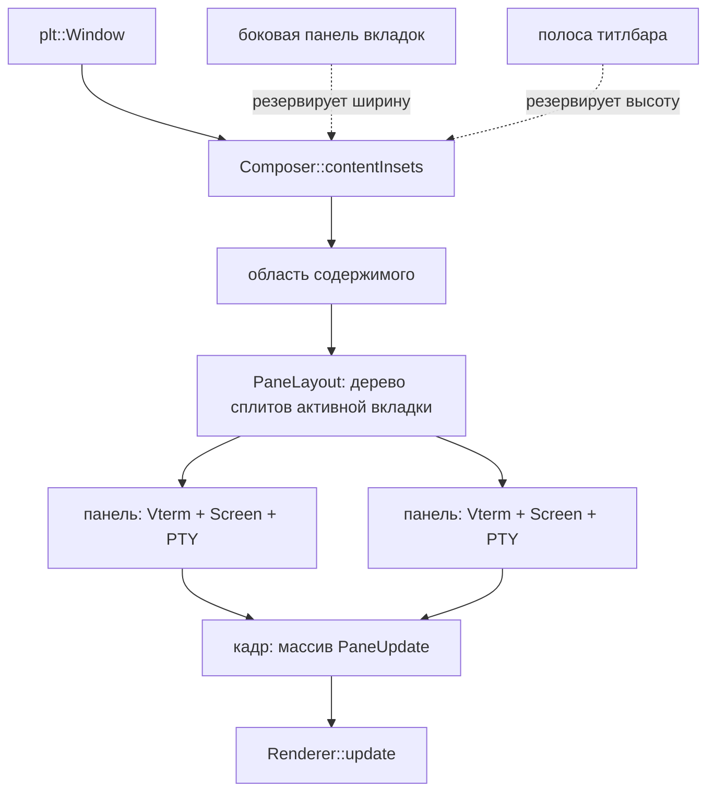

# Архитектура: панели, боковые вкладки и оформление окна

- **Дата:** 2026-08-18
- **План:** `docs/plans/2026-08-18-panes-and-window-chrome.md` (создаётся следом)
- **Статус:** согласовано
- **Предшественники:** `docs/research/2026-08-16-window-features-recon.md` (разведка),
  `docs/reports/commander-window-chrome-2026-08-17.md` (итог прошлой работы)

Документ фиксирует решения под набор фич, которые упираются в две подсистемы:
геометрию окна (отступы, резервы под хром) и рендер (один кадр — одна панель).
Фичи: боковая панель вкладок справа со скрытием по `cmd+b`, автоскрытие
оформления окна по наведению, сплиты панелей, скруглённые углы и запоминание
геометрии quick-окна, фуллскрин quick-окна по хоткею.

## Контекст и ограничения

Что уже построено (проверено по дереву на `feat/window-chrome-upstream`):

- `Renderer` (`lib/shitty/render.h`) — два метода: `update(const TerminalUpdate&)`
  и `repaint()`. Кадр равен одному обновлению, рендерер сам презентует.
- `vterm.cpp` читает `composer.columns` / `composer.rows` **105 раз** — то есть
  размер окна используется терминалом как свой собственный.
- `Composer::borderPixels()` (`lib/shitty/composer.cpp:141`) — один `u16` на все
  четыре стороны, `opts->border * contentScale`. Потребителей — 37 в десяти
  файлах, включая оба рендерера, `vterm.cpp` (9), `test_mode.cpp` (11) и
  headless-путь.
- `SessionSet` (`lib/shitty/session.h`) — плоский список сессий;
  `activate(index)` деактивирует все остальные терминалы.
- `Screen` уже параметризован собственными `columns`/`rows` и к `composer` за
  геометрией не ходит — это единственная часть, готовая к панелям без правок.
- Вкладки рисуются своей `NSView` внутри системного титлбара (`ui_csd_tabs.mm`).
- Уже сделано и работает: `quick`, `quickHotkey`, `quickGeometry`,
  `quickCompanion`, `transparentTitlebar`, `no-decorations`.

Ограничения:

- Проект — **чужой апстрим**. Поведение по умолчанию менять нельзя, всё новое
  живёт за опциями и по умолчанию выключено.
- CI проекта — шесть Linux-проверок; **macOS-код ими не покрыт вообще**.
- Скриншоты агентам недоступны (нет TCC Screen Recording) — визуальное
  подтверждает только человек.
- Запрещён `std::`, только `stl::`. `./style.py` полным прогоном переписывает
  116 файлов дерева, поэтому стиль проверяется по добавленным строкам.
- Проект позиционируется числами латентности в README — регрессия
  производительности рендера недопустима и должна измеряться, а не оцениваться.

Решения пользователя, принятые в диалоге:

- Панели живут **внутри вкладок** (как iTerm2/Ghostty/Warp), а не вместо них.
- Боковая панель показывает **только вкладки**, плоским списком.
- Вручную заданные позиция и размер quick-окна **побеждают** `quickGeometry`.
- Фуллскрин quick-окна — **отдельным хоткеем**, а не автоматически по
  альтернативному экрану.
- `cmd+d` — вертикальный сплит, `cmd+shift+d` — горизонтальный (`cmd+h`
  съедается системным пунктом меню `Hide` и до приложения не доходит).

## Обзор решения

Между окном и терминалом появляется слой раскладки. Окно перестаёт быть равным
одной сетке ячеек: у него есть **резервы под хром** (боковая панель, полоса
титлбара) и **область содержимого**, которая делится деревом панелей.

Ключевой сдвиг: `Vterm` перестаёт считать геометрию окна своей и получает
собственные размеры и начало от слоя раскладки. Рендерер перестаёт принимать
один экран за кадр и принимает список панелей с их прямоугольниками.

## Решения

### A1. Отступ пользователя и резерв под хром — разные понятия

- **Развилка:** как перевести `borderPixels()` на асимметрию.
- **Решение:** не расширять `border` до четырёх чисел. Ввести
  `struct Insets { u16 top, right, bottom, left; }` и `Composer::contentInsets()`,
  где `insets = border (симметрично) + резервы хрома (по сторонам)`.
  Опция `border` сохраняет нынешний смысл и нынешнее имя.
- **Почему:** `border` — пользовательская настройка «воздух вокруг текста».
  Ширина боковой панели и высота титлбарной полосы — факт раскладки, вычисляемый
  системой. Если свести их в одно число, каждый из 37 потребителей обязан знать
  оба смысла, и любая будущая правка одного ломает другое. Разделение оставляет
  опции её семантику и делает миграцию механической.
- **Отвергнуто:**
  - *`border` как четыре значения в конфиге* — переносит верстку интерфейса в
    пользовательскую настройку; пользователь не должен вычитать ширину панели
    вкладок руками.
  - *Оставить скаляр, а панель рисовать поверх сетки* — текст уезжает под
    панель, попадание мыши врёт, выделение и ссылки ломаются.
- **Последствия:** `borderPixels()` остаётся для чтения опции, но **не для
  раскладки**; все места, вычисляющие позиции, переходят на `contentInsets()`.
  Мигрируются: `Composer::resize`, оба рендерера, `render.comp` (начало сетки),
  обратный маппинг мыши в `vterm.cpp`, headless-путь, `test_mode.cpp`.

### A2. Кадр рендерера — список панелей, а не машина состояний

- **Развилка:** как дать рендереру рисовать N панелей за кадр.
- **Решение:** `update` принимает **span из `PaneUpdate`**, где
  `PaneUpdate { Rect area; const TerminalUpdate& update; }`. Один вызов — один
  кадр — один презент. Существующая форма `update(const TerminalUpdate&)`
  остаётся тонкой обёрткой над списком из одного элемента.
- **Почему:** контракт `beginFrame()/updatePane()/endFrame()` вводит состояние,
  которое можно оставить несбалансированным, и требует правок во всех трёх
  бэкендах плюс эталонном рендерере ради инварианта, который список даёт
  бесплатно. Обёртка над списком из одного элемента сохраняет headless-путь и
  существующие тесты без изменений на время миграции.
- **Отвергнуто:**
  - *`beginFrame`/`endFrame`* — см. выше; больше поверхности, больше способов
    ошибиться, нулевая выгода в этом коде.
  - *Отдельный `Compositor` над рендерером* — лишний слой: композиция здесь это
    ровно «нарисовать N прямоугольников», а не самостоятельная подсистема.
- **Последствия:** `render.h`, `render_metal.mm`, `render_vk.cpp`,
  `render_reference.cpp` и `ApplicationImpl::presentTerminal`. Очистка drawable
  перестаёт быть безусловной на весь кадр.

### A3. Арены глифов — на панель, и это измеряется, а не предполагается

- **Развилка:** у каждой сессии свой `Screen` со своим поколением спанов, а в
  рендерере поколение одно (`stripGeneration`).
- **Решение:** арены глифов ведутся **диапазонами на панель**; поколение
  сравнивается в паре с идентификатором панели. Пока диапазоны не введены,
  сплиты не включаются.
- **Почему:** наивная реализация даст полную перезаливку арены каждый кадр при
  двух и более видимых панелях. Проект заявляет числа латентности в README —
  такая регрессия обесценивает фичу и не будет принята апстримом.
- **Требование к приёмке:** прогон `dev/compare.py` (или эквивалентный замер
  пропускной способности) **до и после** на одной панели — цифры не должны
  ухудшиться; и отдельный замер на двух панелях как новая базовая линия.
  Оценка «на глаз» и «выглядит быстро» не принимается.
- **Открытый вопрос:** оптимальная гранулярность диапазона (на панель против на
  сессию) выбирается по результатам замера, а не заранее.

### A4. Дерево панелей живёт внутри вкладки

- **Развилка:** как соотносятся вкладки и сплиты.
- **Решение (пользователь):** у каждой вкладки своё бинарное дерево панелей.
  Узел — либо лист с сессией, либо сплит `{ Direction, доля, левый, правый }`.
  `cmd+d` делит **сфокусированную панель активной вкладки** вертикально,
  `cmd+shift+d` — горизонтально.
- **Почему:** совпадает с iTerm2, Ghostty и Warp — мышечная память переносится.
  Плоская модель «сплиты вместо вкладок» ломает уже работающие `cmd+t` и
  `cmd+1..9`, то есть регрессия ради упрощения внутренней модели.
- **Последствия:** `SessionSet` перестаёт быть плоским списком сессий и
  становится списком вкладок, каждая со своим деревом. Это меняет
  `activeTerminal()`, `count()`, `title(index)`, `activate(index)` — то есть
  публичный интерфейс, на который смотрит `ui_csd_tabs.mm`.
- **Границы:** дерево бинарное; равномерная сетка и произвольные раскладки —
  вне скоупа.

### A5. «Видима» и «в фокусе» — разные состояния терминала

- **Развилка:** `Vterm::activate()/deactivate()` сегодня означают сразу и
  «показывается», и «принимает ввод»; `SessionSet::activate` деактивирует все
  остальные.
- **Решение:** расщепить на два независимых состояния: **видимость** (панель
  находится в дереве активной вкладки — рендерится, будит кадры) и **фокус**
  (принимает ввод, мигает курсором, получает focus-репорты приложения).
  В одной вкладке видимых панелей много, сфокусированная — ровно одна.
- **Почему:** без расщепления при сплите соседняя панель либо гаснет, либо
  считает себя сфокусированной; в обоих случаях приложение внутри получает
  неверный focus-репорт, а выделение сбрасывается не тогда, когда должно.
- **Последствия:** `vterm.h`, `session.cpp`; сохранить обязательное свойство —
  событие фокуса окна по-прежнему доходит до сфокусированной панели.

### A6. Геометрия quick-окна — отдельный файл состояния, не конфиг

- **Развилка:** где хранить вручную заданные позицию и размер.
- **Решение:** отдельный файл состояния (по умолчанию рядом с конфигом бренда,
  например `~/.config/<бренд>/<бренд>-quick-frame`), запись **атомарная**
  (временный файл + `rename`). Приоритет: сохранённый фрейм побеждает
  `quickGeometry`; `quickGeometry` — начальное значение до первого ручного
  изменения. Сброс — удалением файла (и это документируется).
- **Почему:** перезапись пользовательского `.toml` уничтожает комментарии и
  форматирование, а при `quickCompanion` процессов всегда два — они подерутся за
  файл. Атомарная запись нужна по той же причине.
- **Отвергнуто:**
  - *`setFrameAutosaveName:` (NSUserDefaults)* — подерётся с явной установкой
    фрейма на каждом показе и спрячет состояние в неочевидное место.
  - *Только в памяти процесса* — прямо противоречит просьбе «чтобы запоминал».
- **Открытый вопрос:** сохранять ли отдельные фреймы на разные конфигурации
  экранов. Умолчание: один фрейм, при отсутствии экрана — клампить в текущий.

### A7. Ховер меняет видимость, но не геометрию сетки

- **Развилка:** автоскрытие оформления по наведению мыши.
- **Решение:** полоса титлбара **резервируется постоянно** (входит в
  `contentInsets` всё время, пока режим включён), а наведение переключает
  **только видимость** нарисованного в ней. Число строк сетки при этом
  неизменно.
- **Почему:** если показ и скрытие меняют высоту сетки, каждое движение мыши
  через границу шлёт `SIGWINCH` в шелл и заставляет `Vterm` пересобирать
  `Screen` с реflow скроллбэка. Это неприемлемо и было зафиксировано ещё
  разведкой как главный риск фичи.
- **Следствие, которое надо знать:** `cmd+b` (боковая панель), наоборот,
  **меняет** доступную ширину и потому законно вызывает пересчёт сетки — это
  осознанное действие пользователя, эквивалент ресайза окна. Похожие по виду
  фичи, разные по механике.

### A8. `Vterm` получает свою геометрию, а не читает окно

- **Развилка:** 105 обращений к `composer.columns`/`composer.rows` в `vterm.cpp`
  плюс обращения к пиксельным полям.
- **Решение:** ввести поля экземпляра (`columns_`, `rows_`, `originX_`,
  `originY_`), выставляемые слоем раскладки; чтения `composer.*` заменяются на
  них. Пересчёты «пиксель → ячейка» (хит-тест ссылок, mouse-протокол, границы
  автоскролла выделения) учитывают начало панели.
- **Почему:** без этого панель не может знать, что она занимает часть окна, и
  любая фича с двумя видимыми терминалами невозможна.
- **Риск:** самый нагруженный тестами путь — `resizeGrid` (reflow скроллбэка,
  `Screen::resized`, отчёты `CSI 48` при `inBandResizeMode`). Лишний прогон
  шлёт `SIGWINCH` и фантомный resize-report в дочерний процесс. Правка
  механическая по объёму, но не по риску: покрытие тестами обязательно.
- **Уточнение после волны 3** (внесено `R3-arch`, отчёт
  `docs/plans/reviews/panes-R3-arch.md`, находка `B`): три пересчёта
  «пиксель → ячейка» больше не живут в `vterm.cpp` — `T4` вынесла их в
  `lib/shitty/mouse_frontend.{h,cpp}` (`mouseCell`, `mouseSelectionCell`,
  `mouseAutoscrollDirection`), чтобы асимметрию отступов вообще можно было
  проверить тестом. Поэтому `T7` меняет их там, а не в `vterm.cpp`, и её
  список файлов расширен соответственно.
  **`MouseGeometry` сегодня носит `Insets` окна — это не начало панели.** Когда
  панелей станет больше одной, геометрия указателя обязана получать origin
  панели отдельным полем: отступы окна и смещение панели внутри окна
  складываются, но приходят из разных источников, и сведение их в одно поле
  повторит ровно ту ошибку, от которой защищает `A1`.
- **Второе уточнение, после волны 5** (внесено `R5-arch`, отчёт
  `docs/plans/reviews/panes-R5-arch.md`, находка `A5-2`): `A8` описывает только
  направление «пиксель → ячейка». **Обратное направление — «ячейка → пиксель» —
  им не покрыто**, а именно оно якорит окно кандидатов метода ввода и задаёт
  начала панелей (`grid_geometry.h`, `application.cpp`). Пока панель одна, это
  тождество; с двумя панелями обратное направление обязано знать начало панели
  ровно так же, как прямое. `grid_geometry.h` не значится ни в одном списке
  владения плана — владельца ему назначает `T10` вместе с `mouse_frontend`.

## Порядок построения

Зависимости диктуют три фундамента и три группы фич поверх них.

| Фундамент | Что даёт |
|---|---|
| **F-A** асимметричные отступы (A1) | боковую панель и ховер |
| **F-B** геометрия в `Vterm` (A8) | панели вообще |
| **F-C** контракт рендерера и арены (A2, A3) | несколько панелей в кадре |

| Группа фич | На чём стоит |
|---|---|
| quick-окно: углы, сохранение фрейма, фуллскрин по хоткею (A6) | ни на чём — можно делать сразу и параллельно |
| боковая панель вкладок + `cmd+b` | F-A |
| автоскрытие оформления по ховеру (A7) | F-A |
| сплиты `cmd+d` / `cmd+shift+d` (A4, A5) | F-B, F-C |

Группа quick-окна независима и идёт первой не потому, что важнее, а потому что
даёт пользователю результат, пока строятся фундаменты.

## Что осталось за скоупом

- Равномерные сетки панелей и произвольные раскладки — только бинарное дерево.
- Перетаскивание вкладок и панелей мышью между позициями.
- Синхронизация ввода между панелями (broadcast).
- Автоматический фуллскрин по альтернативному экрану — пользователь выбрал
  ручной хоткей.
- Wayland-реализация новых оконных возможностей: заглушки, не реализация.

## Открытые вопросы и точки остановки

1. **Гранулярность арен глифов** (A3) — выбирается по замеру, не заранее.
   Пока замер не сделан, сплиты не включать.
2. **Фрейм quick-окна при смене конфигурации мониторов** (A6) — умолчание
   «один фрейм с клампом», пересмотреть, если окажется неудобным.
3. **Публичный интерфейс `SessionSet` меняется** (A4) — на него смотрит
   `ui_csd_tabs.mm`; изменение контракта в середине работы затронет
   параллельные задачи, поэтому фиксируется в первой волне соответствующей
   группы.
4. **Регрессия производительности рендера** — точка остановки: если замер на
   одной панели ухудшился, работа не продолжается до выяснения причины.
