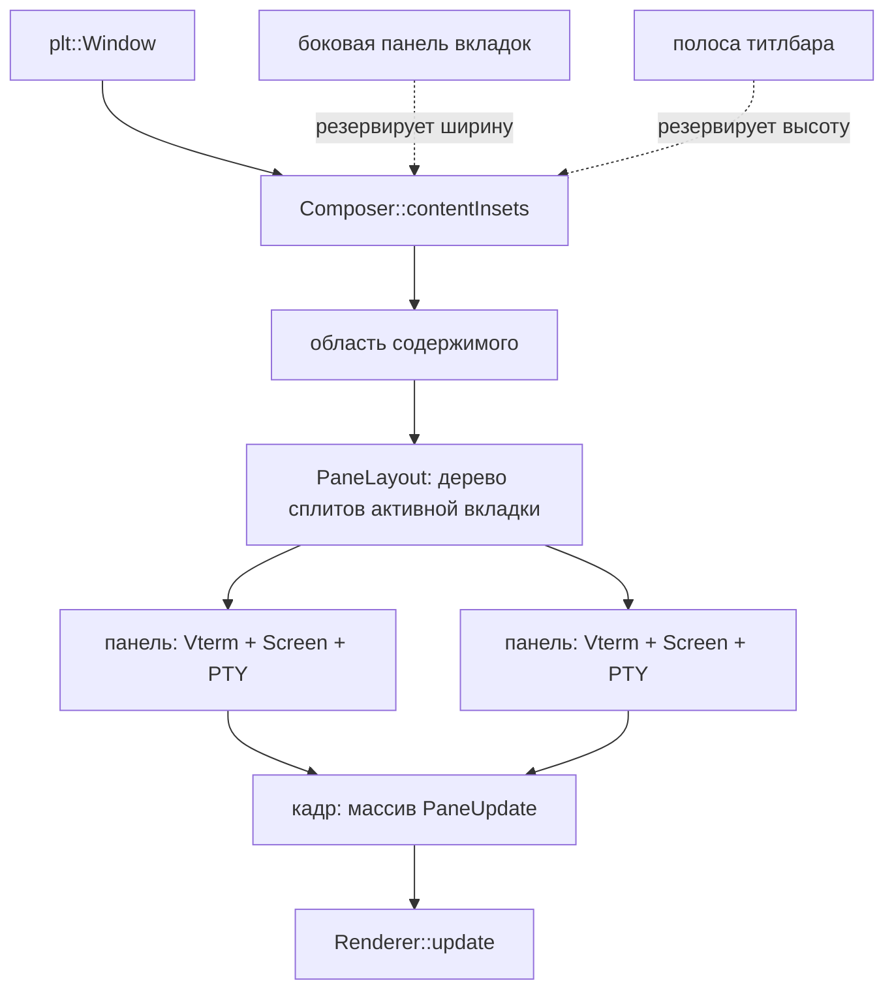

# Архитектура: панели, боковые вкладки и оформление окна

- **Дата:** 2026-08-18
- **План:** `docs/plans/2026-08-18-panes-and-window-chrome.md` (создаётся следом)
- **Статус:** согласовано; дополнен 2026-08-19 после проверочной волны 6
  (`R6-arch`, отчёты `docs/plans/reviews/panes-R6-arch.md` и
  `panes-R6-arch-contract.md`): добавлены `A9`, `A10`, `A11`, уточнено `A2`,
  пересмотрено обоснование `A3`, добавлены открытые вопросы 5 и 6.
- **Предшественники:** `docs/research/2026-08-16-window-features-recon.md` (разведка),
  `docs/reports/commander-window-chrome-2026-08-17.md` (итог прошлой работы)

Документ фиксирует решения под набор фич, которые упираются в две подсистемы:
геометрию окна (отступы, резервы под хром) и рендер (один кадр — одна панель).
Фичи: боковая панель вкладок справа со скрытием по `cmd+b`, автоскрытие
оформления окна по наведению, сплиты панелей, скруглённые углы и запоминание
геометрии quick-окна, фуллскрин quick-окна по хоткею.

## Контекст и ограничения

Что уже построено (проверено по дереву на `feat/window-chrome-upstream`):

- `Renderer` (`lib/shitty/render.h`) — два метода: `update(const TerminalUpdate&)`
  и `repaint()`. Кадр равен одному обновлению, рендерер сам презентует.
- `vterm.cpp` читает `composer.columns` / `composer.rows` **105 раз** — то есть
  размер окна используется терминалом как свой собственный.
- `Composer::borderPixels()` (`lib/shitty/composer.cpp:141`) — один `u16` на все
  четыре стороны, `opts->border * contentScale`. Потребителей — 37 в десяти
  файлах, включая оба рендерера, `vterm.cpp` (9), `test_mode.cpp` (11) и
  headless-путь.
- `SessionSet` (`lib/shitty/session.h`) — плоский список сессий;
  `activate(index)` деактивирует все остальные терминалы.
- `Screen` уже параметризован собственными `columns`/`rows` и к `composer` за
  геометрией не ходит — это единственная часть, готовая к панелям без правок.
- Вкладки рисуются своей `NSView` внутри системного титлбара (`ui_csd_tabs.mm`).
- Уже сделано и работает: `quick`, `quickHotkey`, `quickGeometry`,
  `quickCompanion`, `transparentTitlebar`, `no-decorations`.

Ограничения:

- Проект — **чужой апстрим**. Поведение по умолчанию менять нельзя, всё новое
  живёт за опциями и по умолчанию выключено.
- CI проекта — шесть Linux-проверок; **macOS-код ими не покрыт вообще**.
- Скриншоты агентам недоступны (нет TCC Screen Recording) — визуальное
  подтверждает только человек.
- Запрещён `std::`, только `stl::`. `./style.py` полным прогоном переписывает
  116 файлов дерева, поэтому стиль проверяется по добавленным строкам.
- Проект позиционируется числами латентности в README — регрессия
  производительности рендера недопустима и должна измеряться, а не оцениваться.

Решения пользователя, принятые в диалоге:

- Панели живут **внутри вкладок** (как iTerm2/Ghostty/Warp), а не вместо них.
- Боковая панель показывает **только вкладки**, плоским списком.
- Вручную заданные позиция и размер quick-окна **побеждают** `quickGeometry`.
- Фуллскрин quick-окна — **отдельным хоткеем**, а не автоматически по
  альтернативному экрану.
- `cmd+d` — вертикальный сплит, `cmd+shift+d` — горизонтальный (`cmd+h`
  съедается системным пунктом меню `Hide` и до приложения не доходит).

## Обзор решения

Между окном и терминалом появляется слой раскладки. Окно перестаёт быть равным
одной сетке ячеек: у него есть **резервы под хром** (боковая панель, полоса
титлбара) и **область содержимого**, которая делится деревом панелей.

Ключевой сдвиг: `Vterm` перестаёт считать геометрию окна своей и получает
собственные размеры и начало от слоя раскладки. Рендерер перестаёт принимать
один экран за кадр и принимает список панелей с их прямоугольниками.

## Решения

### A1. Отступ пользователя и резерв под хром — разные понятия

- **Развилка:** как перевести `borderPixels()` на асимметрию.
- **Решение:** не расширять `border` до четырёх чисел. Ввести
  `struct Insets { u16 top, right, bottom, left; }` и `Composer::contentInsets()`,
  где `insets = border (симметрично) + резервы хрома (по сторонам)`.
  Опция `border` сохраняет нынешний смысл и нынешнее имя.
- **Почему:** `border` — пользовательская настройка «воздух вокруг текста».
  Ширина боковой панели и высота титлбарной полосы — факт раскладки, вычисляемый
  системой. Если свести их в одно число, каждый из 37 потребителей обязан знать
  оба смысла, и любая будущая правка одного ломает другое. Разделение оставляет
  опции её семантику и делает миграцию механической.
- **Отвергнуто:**
  - *`border` как четыре значения в конфиге* — переносит верстку интерфейса в
    пользовательскую настройку; пользователь не должен вычитать ширину панели
    вкладок руками.
  - *Оставить скаляр, а панель рисовать поверх сетки* — текст уезжает под
    панель, попадание мыши врёт, выделение и ссылки ломаются.
- **Последствия:** `borderPixels()` остаётся для чтения опции, но **не для
  раскладки**; все места, вычисляющие позиции, переходят на `contentInsets()`.
  Мигрируются: `Composer::resize`, оба рендерера, `render.comp` (начало сетки),
  обратный маппинг мыши в `vterm.cpp`, headless-путь, `test_mode.cpp`.

### A2. Кадр рендерера — список панелей, а не машина состояний

- **Развилка:** как дать рендереру рисовать N панелей за кадр.
- **Решение:** `update` принимает **span из `PaneUpdate`**, где
  `PaneUpdate { Rect area; const TerminalUpdate& update; }`. Один вызов — один
  кадр — один презент. Существующая форма `update(const TerminalUpdate&)`
  остаётся тонкой обёрткой над списком из одного элемента.
- **Почему:** контракт `beginFrame()/updatePane()/endFrame()` вводит состояние,
  которое можно оставить несбалансированным, и требует правок во всех трёх
  бэкендах плюс эталонном рендерере ради инварианта, который список даёт
  бесплатно. Обёртка над списком из одного элемента сохраняет headless-путь и
  существующие тесты без изменений на время миграции.
- **Отвергнуто:**
  - *`beginFrame`/`endFrame`* — см. выше; больше поверхности, больше способов
    ошибиться, нулевая выгода в этом коде.
  - *Отдельный `Compositor` над рендерером* — лишний слой: композиция здесь это
    ровно «нарисовать N прямоугольников», а не самостоятельная подсистема.
- **Последствия:** `render.h`, `render_metal.mm`, `render_vk.cpp`,
  `render_reference.cpp` и `ApplicationImpl::presentTerminal`. Очистка drawable
  перестаёт быть безусловной на весь кадр.
- **Уточнение после волны 6** (внесено `R6-arch`, отчёты
  `docs/plans/reviews/panes-R6-arch.md` и `-contract.md`, находки `A6-1`,
  `A6-2`): `T8` выполнила это решение **на уровне прямоугольников и не могла
  выполнить на уровне сеток** — `PaneUpdate` несёт `PixelRect`, а размер сетки
  панели в контракте отсутствует, поэтому все три бэкенда берут его из окна
  (38 чтений `composer.columns`/`composer.rows`; в `vterm.cpp` после `A8` их
  ноль). Пробел закрывают `A9` и `A10`; сама форма кадра
  `update(const PaneUpdate*, size_t)` при этом не меняется.
- **Зафиксированное расхождение бэкендов, которое надо знать заранее.** Условие
  «очистка перестаёт быть безусловной» выполнено в эталонном рендерере (очистка
  по прямоугольнику панели цветом её терминала) и **сознательно не выполнено в
  Metal** (одна очистка всего drawable цветом первой панели): у Metal
  `loadAction Clear` относится ко всему вложению, а наблюдать артефакт на этой
  машине нечем. Решение принято командиром волны 6 и остаётся в силе. **Цена:**
  на двухпанельном кадре с разными фонами панелей эталон и Metal дают разные
  пиксели на «воздухе» панелей 2..N. Как только появится
  `MetalRendererImpl::captureOutput()`, паритетный тест на двух панелях
  покраснеет **по конструкции**, а не из-за дефекта. Правым в этом расхождении
  считается **эталонный рендерер**: приводить его к Metal запрещено — это сняло
  бы единственную существующую реализацию этого пункта `A2`. Задача на
  `captureOutput()` обязана нести это ожидание в критериях приёмки.

### A3. Арены глифов — на панель, и это измеряется, а не предполагается

- **Развилка:** у каждой сессии свой `Screen` со своим поколением спанов, а в
  рендерере поколение одно (`stripGeneration`).
- **Решение:** арены глифов ведутся **диапазонами на панель**; поколение
  сравнивается в паре с идентификатором панели. Пока диапазоны не введены,
  сплиты не включаются.
- **Почему:** наивная реализация даст полную перезаливку арены каждый кадр при
  двух и более видимых панелях. Проект заявляет числа латентности в README —
  такая регрессия обесценивает фичу и не будет принята апстримом.
- **Требование к приёмке:** прогон `dev/compare.py` (или эквивалентный замер
  пропускной способности) **до и после** на одной панели — цифры не должны
  ухудшиться; и отдельный замер на двух панелях как новая базовая линия.
  Оценка «на глаз» и «выглядит быстро» не принимается.
- **Открытый вопрос:** оптимальная гранулярность диапазона (на панель против на
  сессию) выбирается по результатам замера, а не заранее.
- **Обоснование пересмотрено 2026-08-19** (внесено `R6-arch`, находка `A6-7`).
  Решение остаётся в силе дословно; неверна была его посылка, и она же попала в
  комментарий `lib/shitty/render_arena.h`.
  - **Что было написано:** «у каждой сессии свой `Screen` со своим поколением
    спанов», то есть каждый экран нумерует поколения от своего нуля, и потому
    один скаляр в рендерере сравнил бы число одной панели с числом другой.
  - **Как на самом деле:** поколения выдаёт **процессный монотонный счётчик**,
    `nextShapeGeneration()` (`lib/shitty/screen.cpp:142-151`), и его собственный
    комментарий говорит: «Arena generations are unique across every screen
    instance and lifetime... A renderer keying its device copies on the
    generation must never see two different arenas under one value». Двух
    экранов с одинаковым поколением сегодня не бывает — ни живых, ни через
    переиспользование адреса освобождённого `Screen`.
  - **Почему решение всё равно верное, и причина сильнее прежней.** Счётчик —
    неатомарный `++` по глобальной переменной. Волна 7 приносит много живых
    терминалов; довод «поколение уникально» держится ровно до первого экрана,
    созданного на другом потоке, и до первого, кто решит сделать нумерацию
    попанельной, чтобы эту гонку убрать. Пара «идентичность панели + поколение»
    не зависит ни от того ни от другого: она верна при любой схеме нумерации, и
    стоит один указатель в сравнении.
  - **Практическое следствие для тестов.** Мутации `M1` и `M4` отчёта `T8`
    краснеют на входе, которого при нынешнем счётчике не бывает (два экрана с
    одним номером поколения). Это не дефект тестов: они закрепляют свойство,
    которое обязано пережить смену схемы нумерации. Но покрытием «сегодня без
    идентичности продукт ломается» они **не являются**, и выдавать их за него
    нельзя.
  - **Запрет.** Обнаружив, что поколения уникальны, не «упрощать» зеркало до
    сравнения по одному поколению: это снимает защиту ровно перед волной, ради
    которой она заведена.

### A4. Дерево панелей живёт внутри вкладки

- **Развилка:** как соотносятся вкладки и сплиты.
- **Решение (пользователь):** у каждой вкладки своё бинарное дерево панелей.
  Узел — либо лист с сессией, либо сплит `{ Direction, доля, левый, правый }`.
  `cmd+d` делит **сфокусированную панель активной вкладки** вертикально,
  `cmd+shift+d` — горизонтально.
- **Почему:** совпадает с iTerm2, Ghostty и Warp — мышечная память переносится.
  Плоская модель «сплиты вместо вкладок» ломает уже работающие `cmd+t` и
  `cmd+1..9`, то есть регрессия ради упрощения внутренней модели.
- **Последствия:** `SessionSet` перестаёт быть плоским списком сессий и
  становится списком вкладок, каждая со своим деревом. Это меняет
  `activeTerminal()`, `count()`, `title(index)`, `activate(index)` — то есть
  публичный интерфейс, на который смотрит `ui_csd_tabs.mm`.
- **Границы:** дерево бинарное; равномерная сетка и произвольные раскладки —
  вне скоупа.

### A5. «Видима» и «в фокусе» — разные состояния терминала

- **Развилка:** `Vterm::activate()/deactivate()` сегодня означают сразу и
  «показывается», и «принимает ввод»; `SessionSet::activate` деактивирует все
  остальные.
- **Решение:** расщепить на два независимых состояния: **видимость** (панель
  находится в дереве активной вкладки — рендерится, будит кадры) и **фокус**
  (принимает ввод, мигает курсором, получает focus-репорты приложения).
  В одной вкладке видимых панелей много, сфокусированная — ровно одна.
- **Почему:** без расщепления при сплите соседняя панель либо гаснет, либо
  считает себя сфокусированной; в обоих случаях приложение внутри получает
  неверный focus-репорт, а выделение сбрасывается не тогда, когда должно.
- **Последствия:** `vterm.h`, `session.cpp`; сохранить обязательное свойство —
  событие фокуса окна по-прежнему доходит до сфокусированной панели.

### A6. Геометрия quick-окна — отдельный файл состояния, не конфиг

- **Развилка:** где хранить вручную заданные позицию и размер.
- **Решение:** отдельный файл состояния (по умолчанию рядом с конфигом бренда,
  например `~/.config/<бренд>/<бренд>-quick-frame`), запись **атомарная**
  (временный файл + `rename`). Приоритет: сохранённый фрейм побеждает
  `quickGeometry`; `quickGeometry` — начальное значение до первого ручного
  изменения. Сброс — удалением файла (и это документируется).
- **Почему:** перезапись пользовательского `.toml` уничтожает комментарии и
  форматирование, а при `quickCompanion` процессов всегда два — они подерутся за
  файл. Атомарная запись нужна по той же причине.
- **Отвергнуто:**
  - *`setFrameAutosaveName:` (NSUserDefaults)* — подерётся с явной установкой
    фрейма на каждом показе и спрячет состояние в неочевидное место.
  - *Только в памяти процесса* — прямо противоречит просьбе «чтобы запоминал».
- **Открытый вопрос:** сохранять ли отдельные фреймы на разные конфигурации
  экранов. Умолчание: один фрейм, при отсутствии экрана — клампить в текущий.

### A7. Ховер меняет видимость, но не геометрию сетки

- **Развилка:** автоскрытие оформления по наведению мыши.
- **Решение:** полоса титлбара **резервируется постоянно** (входит в
  `contentInsets` всё время, пока режим включён), а наведение переключает
  **только видимость** нарисованного в ней. Число строк сетки при этом
  неизменно.
- **Почему:** если показ и скрытие меняют высоту сетки, каждое движение мыши
  через границу шлёт `SIGWINCH` в шелл и заставляет `Vterm` пересобирать
  `Screen` с реflow скроллбэка. Это неприемлемо и было зафиксировано ещё
  разведкой как главный риск фичи.
- **Следствие, которое надо знать:** `cmd+b` (боковая панель), наоборот,
  **меняет** доступную ширину и потому законно вызывает пересчёт сетки — это
  осознанное действие пользователя, эквивалент ресайза окна. Похожие по виду
  фичи, разные по механике.

### A8. `Vterm` получает свою геометрию, а не читает окно

- **Развилка:** 105 обращений к `composer.columns`/`composer.rows` в `vterm.cpp`
  плюс обращения к пиксельным полям.
- **Решение:** ввести поля экземпляра (`columns_`, `rows_`, `originX_`,
  `originY_`), выставляемые слоем раскладки; чтения `composer.*` заменяются на
  них. Пересчёты «пиксель → ячейка» (хит-тест ссылок, mouse-протокол, границы
  автоскролла выделения) учитывают начало панели.
- **Почему:** без этого панель не может знать, что она занимает часть окна, и
  любая фича с двумя видимыми терминалами невозможна.
- **Риск:** самый нагруженный тестами путь — `resizeGrid` (reflow скроллбэка,
  `Screen::resized`, отчёты `CSI 48` при `inBandResizeMode`). Лишний прогон
  шлёт `SIGWINCH` и фантомный resize-report в дочерний процесс. Правка
  механическая по объёму, но не по риску: покрытие тестами обязательно.
- **Уточнение после волны 3** (внесено `R3-arch`, отчёт
  `docs/plans/reviews/panes-R3-arch.md`, находка `B`): три пересчёта
  «пиксель → ячейка» больше не живут в `vterm.cpp` — `T4` вынесла их в
  `lib/shitty/mouse_frontend.{h,cpp}` (`mouseCell`, `mouseSelectionCell`,
  `mouseAutoscrollDirection`), чтобы асимметрию отступов вообще можно было
  проверить тестом. Поэтому `T7` меняет их там, а не в `vterm.cpp`, и её
  список файлов расширен соответственно.
  **`MouseGeometry` сегодня носит `Insets` окна — это не начало панели.** Когда
  панелей станет больше одной, геометрия указателя обязана получать origin
  панели отдельным полем: отступы окна и смещение панели внутри окна
  складываются, но приходят из разных источников, и сведение их в одно поле
  повторит ровно ту ошибку, от которой защищает `A1`.
- **Второе уточнение, после волны 5** (внесено `R5-arch`, отчёт
  `docs/plans/reviews/panes-R5-arch.md`, находка `A5-2`): `A8` описывает только
  направление «пиксель → ячейка». **Обратное направление — «ячейка → пиксель» —
  им не покрыто**, а именно оно якорит окно кандидатов метода ввода и задаёт
  начала панелей (`grid_geometry.h`, `application.cpp`). Пока панель одна, это
  тождество; с двумя панелями обратное направление обязано знать начало панели
  ровно так же, как прямое. `grid_geometry.h` не значится ни в одном списке
  владения плана — владельца ему назначает `T10` вместе с `mouse_frontend`.

### A9. Размер сетки панели едет вместе с данными этой сетки, а не с её прямоугольником

- **Дата:** 2026-08-19, после волны 6 (`R6-arch`, находка `A6-1`).
- **Развилка:** `A2` дала рендереру прямоугольник панели и не дала её сетку.
  `PaneUpdate { PixelRect area; const TerminalUpdate& update; }` не содержит ни
  `columns`, ни `rows`, а `TerminalUpdate::rowCount` — это число **повреждённых**
  строк, не высота сетки. Ширина строки не указана нигде. Поэтому все три
  бэкенда берут размер сетки панели из окна: 7 чтений в `render_metal.mm`,
  23 в `render_reference.cpp`, 8 в `render_vk.cpp`. В `vterm.cpp` после `A8`
  таких чтений **ноль** — терминал свою сетку знает, рендерер её не спрашивает.
- **Решение:** `TerminalUpdate` получает два поля — **`gridColumns`** и
  **`gridRows`**, — которые описывают форму его собственных данных: ширину
  массива `TerminalRow::cells` и высоту сетки, в которую индексирует `row.row`.
  `PaneUpdate` и `PixelRect` **не меняются**: контракт `T1` остаётся в силе
  дословно. Все чтения `composer.columns`/`composer.rows` в рендерерах
  заменяются на поля обновления — все 38, исключений нет.
  Имена именно такие, потому что в `TerminalUpdate` уже есть `rows` (указатель
  на повреждённые строки) и `rowCount`; «привести имена в порядок» позже
  означает столкнуть высоту сетки с массивом строк.
- **Ноль — это отказ, а не окно.** Обновление с `gridColumns == 0` или
  `gridRows == 0` рендерер отклоняет (`return false`), как уже отклоняет
  `colors == nullptr` и `row.cells == nullptr`. Умолчания «взять размер окна»
  нет и быть не должно: поле, которое все заполняли бы размером окна, спрятало
  бы пробел вместо того, чтобы его отметить, — тот же довод, которым `F5`
  отказалась выдавать протяжённость контентной коробки заранее.
- **Почему именно `TerminalUpdate`, а не `PaneUpdate`:**
  - Эти два числа описывают **длину буфера**, который обновление несёт. Сегодня
    рендерер читает `composer.columns` ячеек из `row.cells`, не будучи об этой
    длине извещён; панель в 40 колонок при окне в 80 — это чтение за границей, а
    не смещённая раскладка. Длина массива обязана ехать рядом с массивом.
  - Беспанельная форма `update(const TerminalUpdate&)` строит панель через
    `surfacePane(composer, update)`. Живи размер в `PaneUpdate`, эта функция
    была бы обязана взять его из `composer` — и оконное умолчание уцелело бы
    ровно там, где через него ходят `MirrorRenderer` из `test_mode.cpp`,
    headless-путь и все тесты рендерера. С размером внутри `TerminalUpdate`
    `surfacePane()` его не касается вовсе, и беспанельный путь становится
    правильным сам собой.
  - `PaneGeometry` (`vterm.h:52`) при этом **не** переезжает в `TerminalUpdate`
    целиком: её `originX`/`originY` — это то же самое число, что
    `PaneUpdate::area.x/y`. Две записи одной величины — тот самый дефект, что
    уже записан за `SessionSetImpl::ptySize()` (`A5-4`); повторять его нельзя.
- **Отвергнуто:**
  - *Расширить `PaneUpdate` полями `columns`/`rows`* — см. довод про
    `surfacePane()` выше: сохраняет оконное умолчание в беспанельной форме.
  - *Спрашивать размер у `update.shapes`* — `Screen` его знает, но `shapes`
    бывает нулевым (синтетические обновления `renderUpdate()`,
    `test_mode.cpp`), то есть источник исчезает ровно там, где нужен.
  - *Оставить как есть и полагаться на клип* — сегодня две панели это две сетки
    размера окна, у каждой половина уходит за клип. Клип из ограничения
    превращается в то, что прячет неверный размер, а работа рендерера растёт
    вдвое при том же видимом содержимом.
- **Последствия и что именно ломается:**
  - Производители обновлений: `VtermImpl::fillTerminalUpdate()`
    (`vterm.cpp:2472`) — две строки, `columns_` и `rows_` там уже есть;
    `ReferenceRendererImpl::renderUpdate()` (`render_reference.cpp:786`) — две
    строки, `columns_`/`rows_` тоже члены.
  - `test_mode.cpp` — **ноль правок**: он берёт обновление у `renderUpdate()`.
    `screen_ut.cpp` — ноль правок: он не рендерит.
  - `render_reference_ut.cpp` — около восьми мест, строящих `TerminalUpdate`
    руками; сводится к одному помощнику.
  - Сторож в духе `border_pixels_guard`: `composer.columns`/`composer.rows`
    запрещены в `render*.{h,cpp,mm}`. Это тот же инструмент и тот же критерий,
    которым `T7` закрыла `vterm.cpp`.
  - Замер `T8` на **одной** панели остаётся в силе: при одной панели
    `gridColumns == composer.columns` по построению. Базовую линию на **двух**
    панелях надо снять заново — она станет дешевле, а не дороже.

### A10. Отступ окна и отступ панели — два разных преобразования, а не одно число

- **Дата:** 2026-08-19, после волны 6 (`R6-arch`, находка `A6-2`).
- **Развилка:** начало сетки панели считается как её прямоугольник **плюс
  `Composer::contentInsets()`** (`render_metal.mm:782-783`,
  `render_reference.cpp:491-493`), а `contentInsets()` — это `border` **плюс
  резервы хрома** на каждую сторону. При одной панели во всю поверхность это
  тождество. При сплите правая панель получит внутрь себя ещё раз ширину
  боковой панели, нижняя — ещё раз высоту титлбарной полосы.
- **Что `A1` разделила и чего не разделила.** `A1` развела **понятия**:
  `border` — пользовательский воздух вокруг текста, резерв хрома — факт
  раскладки. Она не развела **преобразования**, потому что при одной панели их
  два, но выглядят они как одно:
  1. прямоугольник окна → контентная коробка: вычесть **резервы хрома**;
  2. прямоугольник панели → начало её сетки: прибавить **`border`**.
  `contentInsets()` — это их композиция, и она верна ровно тогда, когда панель
  и есть окно.
- **Решение:** `Composer` публикует оба преобразования по отдельности, а
  композицию оставляет с честной пометкой:
  - `Insets chromeInsets() const` — только резервы хрома, отмасштабированные.
    Ими слой раскладки получает контентную коробку из окна.
  - `Insets paneInsets() const` — `border` на все четыре стороны. Им бэкенд
    получает начало сетки из прямоугольника панели.
  - `Insets contentInsets() const` — их сумма, как сейчас, поле в поле. Остаётся
    для `Composer::resize()` (он считает сетку окна с одной панелью — ровно то,
    что `windowPane()` уже называет) и для всех, кому панель равна окну.
    Документируется как **композиция, верная только пока панель — это окно**;
    те, кто должен перестать её звать, — это те, кто её всё ещё называет. Тот
    же приём, что `windowPane()` и `surfacePane()`.
- **Почему не заплатка в рендерере.** «Вычесть лишнее на месте» означало бы, что
  каждый потребитель снова обязан знать оба смысла, — ровно то, от чего `A1`
  ушла, и с той же ценой: любая будущая правка одного ломает другое.
- **Почему не через `borderPixels()` напрямую.** `A1` оставила `borderPixels()`
  роль «чтение опции, но не раскладка» и завела на неё сторож
  (`border_pixels_guard`, `build.py:1180`). Дать ей обратно роль раскладки
  значит внести файлы рендерера в допуски сторожа, то есть ослабить инструмент,
  который `A1` для этого и построила. `paneInsets()` — отдельное имя, сторож
  остаётся нетронутым.
- **Остаток от деления остаётся у дальнего края**, как сегодня: панель ставит
  сетку от своего начала, а неизрасходованные пиксели копятся справа и снизу.
  Следствие, которое надо знать `T10`: на вертикальном сплите шов между
  панелями шириной `border + остаток левой + border` — там же `T10` и рисует
  разделитель. Изменение этого правила меняет картинку, а не корректность.
- **Последствия:** `composer.h`, `composer.cpp` (две маленькие функции, нового
  состояния нет — `contentInsets()` уже сложена ровно из этих двух частей),
  оба бэкенда и эталонный рендерер. `borderPixels()`, его сторож и все нынешние
  вызовы `contentInsets()` вне рендерера не трогаются.

### A11. Склад, общий на окно, размеряется суммой по живым панелям

- **Дата:** 2026-08-19, после волны 6 (`R6-arch`; долг `A5-6` из
  `docs/plans/reviews/panes-R5-arch.md`, вопрос `Q2` волны 5).
- **Развилка:** в `Composer` живут склады, общие на всё окно, а бюджеты в них
  пишет каждый терминал по своей ёмкости — последний победил. Пока терминал
  один, «последний» и «все» — одно и то же число; после `A8` это перестаёт быть
  верным, и `F5` смогла закрыть вопрос только **верхней границей** «по окну»
  вместо точной суммы, потому что списка живых терминалов ей взять было негде.
- **Решение:** любой склад, общий на окно, размеряется **суммой по живым
  панелям**, а не оценкой по окну и не последним записавшим. Список живых
  панелей — это дерево панелей из `A4`; там сумма считается локально, без
  глобального реестра терминалов и без гонки при `--threads>1`.
- **Образец уже есть в дереве.** `PaneArenaMirror::used()`
  (`lib/shitty/render_arena.h:76-78`) размеряет буфер арен именно суммой по
  панелям кадра. То есть волна 6 решила эту задачу правильно в одном складе и
  оставила нерешённой в другом — это класс дефекта, а не единичный случай.
- **Кого это касается сегодня:** `CellExtraStore` (`composer.h:173`), бюджет
  которому пишет `VtermImpl::updateExtraCellCount()` (`vterm.cpp:3207`), а
  собирает `cell_extra_store.cpp`. Заметность плохая: не падает, а собирает
  мусор не вовремя, то есть проявится замером латентности, а не ошибкой.
- **Владелец:** задача, которая строит дерево панелей (`T9`), — потому что
  список живых терминалов появляется вместе с ним, а не потому что там удобно.
  Её владение обязано включать `cell_extra_store.{h,cpp}` и
  `updateExtraCellCount()`, иначе передача повиснет ровно так же, как повисла на
  волне 6.
- **Правило на будущее:** заводя в `Composer` склад, общий на окно, назвать
  здесь, как он размеряется. Молчание означает «по последнему записавшему», и
  это всегда неверно, как только панелей больше одной.

## Порядок построения

Зависимости диктуют три фундамента и три группы фич поверх них.

| Фундамент | Что даёт |
|---|---|
| **F-A** асимметричные отступы (A1) | боковую панель и ховер |
| **F-B** геометрия в `Vterm` (A8) | панели вообще |
| **F-C** контракт рендерера и арены (A2, A3) | несколько панелей в кадре |
| **F-D** сетка панели и отступ панели (A9, A10) | панели **разного размера** в кадре |

`F-D` добавлен после волны 6. Он не был виден заранее, потому что при одной
панели сетка панели и сетка окна — одно число, а отступ панели и отступ окна —
одно преобразование; `F-C` построил кадр из прямоугольников, и только тогда
стало видно, что содержимое этих прямоугольников по-прежнему оконного размера.
`F-D` стоит на `F-C` и **обязан лечь раньше сплитов**: без него панели в кадре
могут быть только одинаковыми и равными окну.

| Группа фич | На чём стоит |
|---|---|
| quick-окно: углы, сохранение фрейма, фуллскрин по хоткею (A6) | ни на чём — можно делать сразу и параллельно |
| боковая панель вкладок + `cmd+b` | F-A |
| автоскрытие оформления по ховеру (A7) | F-A |
| сплиты `cmd+d` / `cmd+shift+d` (A4, A5) | F-B, F-C, **F-D** |

Группа quick-окна независима и идёт первой не потому, что важнее, а потому что
даёт пользователю результат, пока строятся фундаменты.

## Что осталось за скоупом

- Равномерные сетки панелей и произвольные раскладки — только бинарное дерево.
- Перетаскивание вкладок и панелей мышью между позициями.
- Синхронизация ввода между панелями (broadcast).
- Автоматический фуллскрин по альтернативному экрану — пользователь выбрал
  ручной хоткей.
- Wayland-реализация новых оконных возможностей: заглушки, не реализация.

## Открытые вопросы и точки остановки

1. **Гранулярность арен глифов** (A3) — выбирается по замеру, не заранее.
   Пока замер не сделан, сплиты не включать.
2. **Фрейм quick-окна при смене конфигурации мониторов** (A6) — умолчание
   «один фрейм с клампом», пересмотреть, если окажется неудобным.
3. **Публичный интерфейс `SessionSet` меняется** (A4) — на него смотрит
   `ui_csd_tabs.mm`; изменение контракта в середине работы затронет
   параллельные задачи, поэтому фиксируется в первой волне соответствующей
   группы.
4. **Регрессия производительности рендера** — точка остановки: если замер на
   одной панели ухудшился, работа не продолжается до выяснения причины.
5. **Двухпанельный кадр не проверяется машинно нигде** (внесено `R6-arch` после
   волны 6, находка `A6-6`). `captureOutput()` реализован только в Vulkan
   (`render_vk.cpp:2212`), `tst/test_vulkan_parity.py` привязан к Linux, а
   Vulkan две панели отклоняет (`render_vk.cpp:2172`). Значит ни на машине
   разработчика (у Metal нет чтения кадра), ни в CI (там нет Metal) панельный
   кадр не сравнивается ни с чем. **Две разные задачи, и они не заменяют друг
   друга:** `MetalRendererImpl::captureOutput()` закрывает слепоту на macOS;
   панели в Vulkan закрывают регрессии в CI. Пока не сделано ни то ни другое,
   единственная проверка `A2` на двух панелях — эталонный рендерер сам против
   себя, и это надо называть вслух, а не считать покрытием.
6. **`border` каждой панели против одного шва между панелями** (`A10`) —
   умолчание «у каждой панели свой `border`, остаток у дальнего края, разделитель
   рисуется в получившемся шве». Это выбор картинки, а не корректности;
   пересмотреть, если на живом сплите шов окажется слишком широким.
